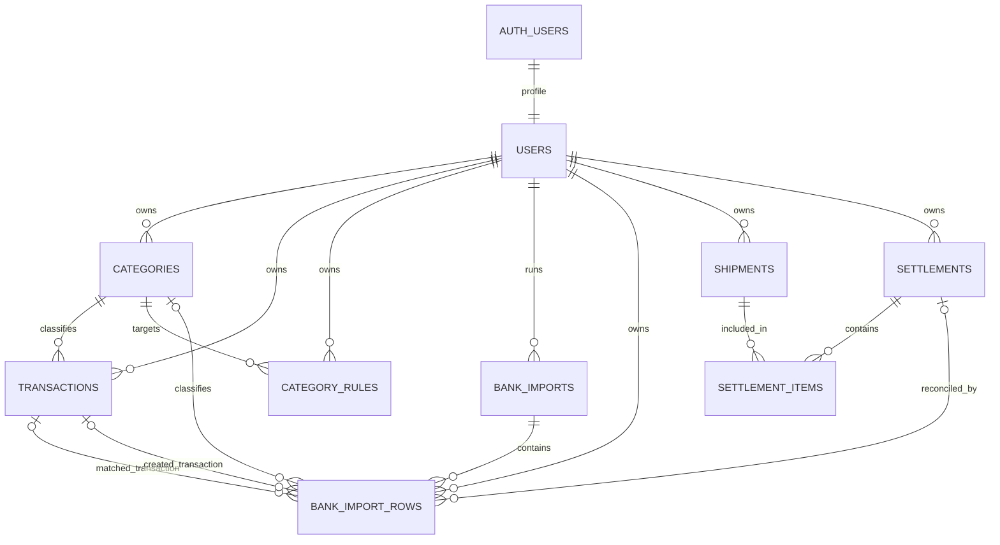

# ERD — Anteraja Finance

## Kardinalitas

- Satu akun auth memiliki tepat satu profil publik.
- Satu user dapat memiliki banyak kategori, transaksi, aturan, import, shipment, dan settlement.
- Satu kategori dapat dipakai banyak transaksi dan aturan.
- Satu import memiliki banyak baris; setiap baris dapat menunjuk transaksi lama atau transaksi baru, tidak wajib keduanya.
- `settlement_items` menghubungkan settlement dan shipment. Bentuk tabel penghubung membuat koreksi/adjustment tetap dapat dikembangkan tanpa menaruh kolom keuangan berulang pada `shipments`.
- Satu baris mutasi dapat menunjuk satu settlement. Settlement hanya menjadi `reconciled` jika nominal mutasi sama dengan nilai bersih settlement.

## Integritas lintas user

RLS mencegah akses antarpengguna pada level query. Untuk relasi shipment–settlement, database juga memakai composite foreign key `(entity_id, user_id)`. Artinya data user A tidak dapat ditautkan ke data user B sekalipun query dijalankan oleh proses server dengan hak lebih tinggi.
