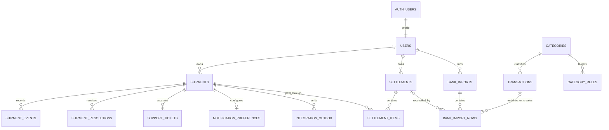

# ERD — Anteraja Tracking & Operations

Satu resi memiliki banyak event, instruksi penerima, tiket, dan pesan integrasi. Resi dapat masuk ke settlement melalui `settlement_items`; settlement dicocokkan dengan baris mutasi. Jejak dari bank sampai perjalanan paket tetap dapat diaudit.

Semua entitas bisnis memakai `user_id` dan RLS. Relasi kritis memakai composite FK. Tracking publik melewati RPC terkontrol yang memeriksa kode akses dan memasking PII; role publik tidak mendapat akses tabel langsung.
