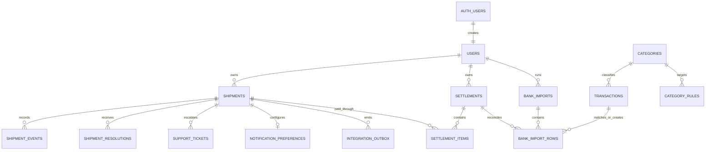

# ERD - Anteraja Tracking & Operations

Gambar final tersedia pada [`erd/anteraja-database-erd.webp`](erd/anteraja-database-erd.webp). Diagram berikut menyediakan versi teks yang dapat dirawat bersama migration.

## Kardinalitas utama

Satu resi memiliki banyak event, instruksi penerima, tiket, dan pesan integrasi. Satu resi mempunyai maksimal satu preferensi notifikasi. Resi masuk ke settlement melalui `settlement_items`; settlement kemudian dapat dicocokkan dengan satu atau beberapa baris mutasi.

Semua entitas bisnis memakai `user_id` dan RLS. Relasi kritis memakai composite FK. Tracking publik melewati RPC terkontrol yang memeriksa kode akses dan memasking PII; role publik tidak mendapat akses tabel langsung.

`tracking_rate_limits` berdiri sendiri karena kuncinya adalah client key anonim, bukan akun login. Tabel tersebut melindungi endpoint tracking dari request berlebihan tanpa menyimpan identitas penerima.
