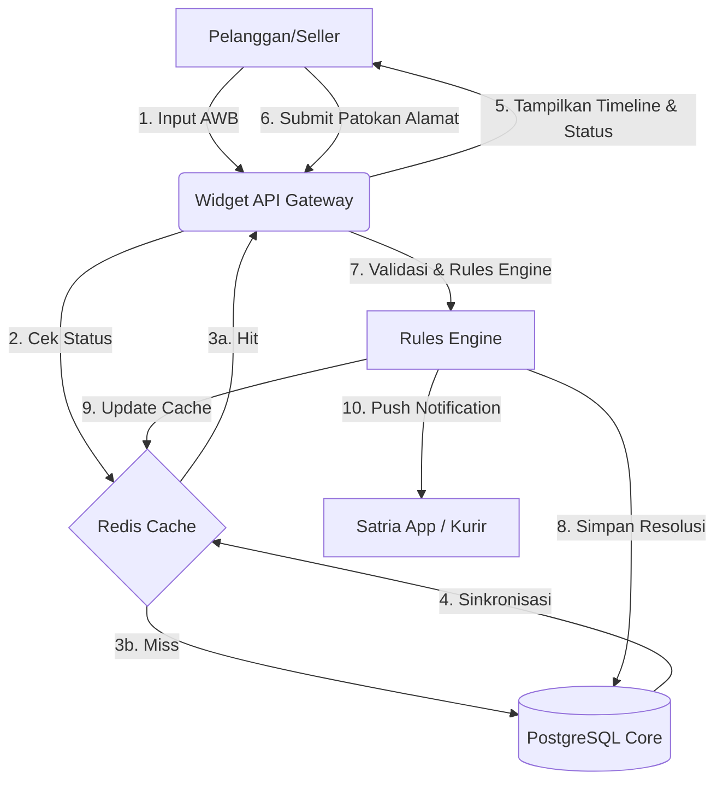
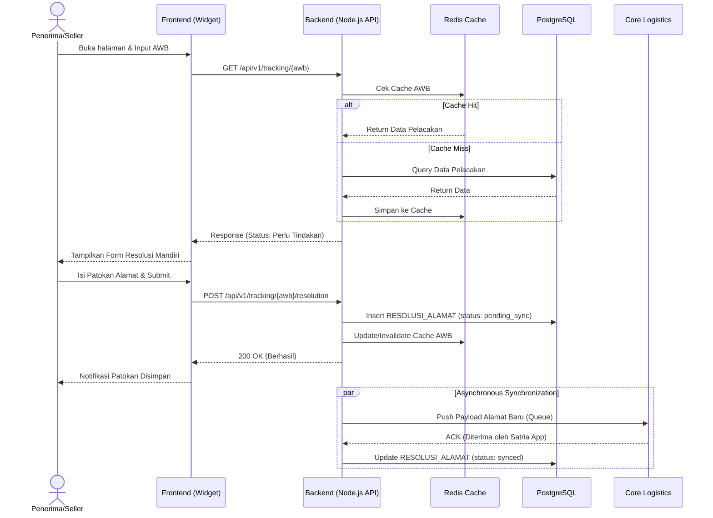
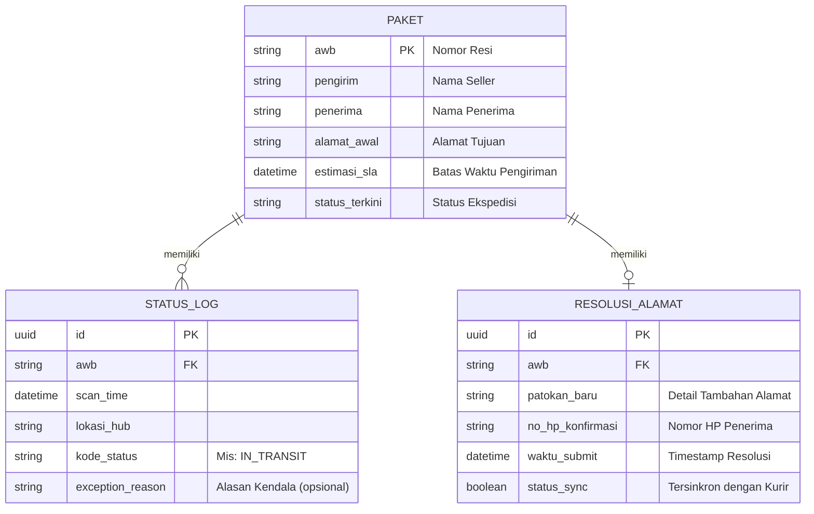

# FUNCTIONAL REQUIREMENTS DOCUMENT (FRD)
## Anteraja Shipment Tracking Widget (MVP)

---

| Document Parameter | Specification Details |
| :--- | :--- |
| **Product Name** | Anteraja Shipment Tracking Widget (MVP) |
| **Document Version** | 1.0 (Final Comprehensive Technical Release) |
| **Author** | Evan William (Maxy Academy - Module 1) |
| **Target Launch Date** | 16 September 2026 |
| **Document Status** | Approved for Engineering Build |
| **System Compatibility** | Anteraja Core Logistics Adapter & Merchant Dashboard Widget |

---

## 1. DOKUMEN KONTROL & ARSITEKTUR SISTEM

### 1.1 Diagram Arsitektur Tingkat Tinggi (*High-Level Architecture*)

Sistem dibangun menggunakan pendekatan arsitektur terdekoppel (*decoupled architecture*) dengan pola *Adapter Layer* untuk menjamin *fault isolation* dari *core logistics system* Anteraja.

```
 [User Browser / Seller Widget] <---> [Next.js Frontend / React Widget]
                                                  |
                                            (HTTPS / REST)
                                                  v
                                     [API Gateway & Rate Limiter]
                                                  |
                                                  v
                                      [Node.js / TypeScript API]
                                                  |
                         +------------------------+------------------------+
                         |                                                 |
                         v                                                 v
                 [Redis Cache Layer]                             [Rules Engine Service]
           (Query Speed < 20ms p95)                         (SLA Risk & Exception Logic)
                         |                                                 |
                         +------------------------+------------------------+
                                                  |
                                                  v
                                     [PostgreSQL Transactional DB]
                                                  ^
                                                  | (Read-Only Replica / Webhook)
                                                  v
                                  [Anteraja Core Logistics System]
```

### 1.2 Ringkasan Tech Stack


### 1.3 Data Flow Diagram (DFD)
Berikut adalah gambaran aliran data (Data Flow) utama untuk fitur Resolusi Mandiri Anteraja Tracking:




### 1.5 Sequence Diagram (Seq) - Alur Resolusi Patokan Alamat
Diagram sekuensial ini memetakan interaksi teknis antar-layanan (FE, BE, DB, Cache) sesuai skema *System Design* saat pengguna melakukan pembaruan alamat.



### 1.4 Logical Record Structure (LRS)
Berikut adalah rancangan entitas data relasional (LRS) yang mendukung pelacakan dan resolusi kendala:



* **Frontend Layer**: Next.js / React (Widget responsif, dapat di-embed via `<script>` atau `<iframe>`).
* **API Gateway & Backend Layer**: Node.js dengan TypeScript (RESTful API / OpenAPI 3.0 Standard).
* **Caching Layer**: Redis Cluster (Menyimpan *state tracking* aktif & meminimalisir *hit* ke DB utama).
* **Database Layer**: PostgreSQL (Menyimpan log transaksi, audit trail resolusi, dan taksonomi kendala).
* **Decision Engine**: Custom Lightweight Rules Engine (TypeScript-based).
* **Notification Adapter**: Adapter WhatsApp Business API / Firebase Cloud Messaging (FCM).

---

## 2. SPESIFIKASI SKEMA DATA (SPATIAL & OPERATIONAL DATASET)

Sistem memproses dan merender data logistik berdasarkan integrasi dua dataset utama: `final_dataset_cleaned.csv` dan `indonesia-last-mile-delivery-cleaned.csv`.

### 2.1 Pemetaan 11 Atribut Data Utama (`final_dataset_cleaned.csv`)

| Nama Kolom Data | Tipe Data | Nullable? | Deskripsi & Fungsi Operasional Sistem |
| :--- | :--- | :--- | :--- |
| `AWB` | `VARCHAR(20)` | **No** | Primary Key / Nomor Resi Unik Pelacakan (Contoh: `ANT-100000`). |
| `Kecamatan` | `VARCHAR(100)`| Yes | Nama Kecamatan Wilayah Pengiriman (Contoh: `Pontianak Utara`). |
| `Jalan` | `VARCHAR(255)`| **No** | Nama Jalan Utama Segmen Last-Mile (Contoh: `Jalan Khatulistiwa`). |
| `Jarak_m` | `NUMERIC(10,2)`| Yes | Jarak Segmen Jalan dalam Satuan Meter (Contoh: `6570.00`). |
| `Bagian` | `VARCHAR(100)`| Yes | Detail Sub-segmen / Patokan Wilayah (Contoh: `Ujung 1`). |
| `Latitude` | `DECIMAL(10,8)`| Yes | Koordinat Geografis Lintang untuk Pemetaan/Geofencing. |
| `Longitude` | `DECIMAL(11,8)`| Yes | Koordinat Geografis Bujur untuk Pemetaan/Geofencing. |
| `Scan_Time` | `TIMESTAMP` | **No** | Waktu Pembaruan Event Pergerakan Paket Terakhir (ISO-8601). |
| `Status` | `ENUM` | **No** | Kondisi Pergerakan Paket (`In Transit`, `Out for Delivery`, `Delivered`, `Failed Delivery`). |
| `SLA_Status` | `ENUM` | **No** | Kalkulasi Risiko SLA dari Rules Engine (`Sesuai Jadwal`, `Berisiko`, `Perlu Tindakan`). |
| `Exception_Reason` | `VARCHAR(255)`| **No** | Penjelasan Kendala Lapangan dalam Bahasa Konsumen (Atribut `-`, `Penerima tidak di tempat`, `Alamat tidak ditemukan / Patokan kurang jelas`). |

### 2.2 Integrasi Data Jaringan Last-Mile (`indonesia-last-mile-delivery-cleaned.csv`)
Atribut `Kecamatan`, `Jalan`, `Jarak_m`, `Bagian`, `Latitude`, dan `Longitude` bersumber dari pemetaan spasial jaringan jalan Kota Pontianak. Data ini digunakan untuk:
1. **Penyusunan Dropdown Lokasi**: Mempermudah penerima memilih kecamatan dan jalan yang valid saat memperbarui alamat.
2. **Geofencing Verification**: Memastikan kurir melakukan *scan exception* di sekitar koordinat lokasi yang valid.

---

## 3. LOGIKA BISNIS & RULES ENGINE SPECIFICATION

### 3.1 Matriks Aturan Kalkulasi Risiko SLA (`SLA_Status`)

Rules Engine secara otomatis mengevaluasi atribut `Status`, `Scan_Time`, dan `Exception_Reason` setiap kali menerima pembaruan *event scan*.

```
IF Status = 'Delivered' THEN SLA_Status = 'Sesuai Jadwal'
ELSE IF Exception_Reason != '-' THEN
    IF Exception_Reason IN ('Alamat tidak ditemukan / Patokan kurang jelas', 'Penerima tidak di tempat') AND Status = 'Failed Delivery' THEN
        SLA_Status = 'Perlu Tindakan'
    ELSE IF Status = 'In Transit' THEN
        SLA_Status = 'Berisiko'
    END IF
ELSE IF (Current_Time - Scan_Time) > 6 Hours AND Status = 'In Transit' THEN
    SLA_Status = 'Berisiko'
ELSE
    SLA_Status = 'Sesuai Jadwal'
END IF
```

### 3.2 Taksonomi Kendala & Pemetaan Aksi Mandiri (*Next Best Action Matrix*)

| Exception_Reason di CSV | Status Paket | SLA_Status | Komponen UI Form yang Dideploy | Aksi Sistem Backend |
| :--- | :--- | :--- | :--- | :--- |
| `-` (Tidak ada kendala) | `Out for Delivery` / `Delivered` | `Sesuai Jadwal` 🟢 | Standard Timeline View (Read-Only) | No Action required. |
| `Alamat tidak ditemukan / Patokan kurang jelas` | `In Transit` | `Berisiko` 🟡 | Warning Alert + Form Input Patokan Singkat | Mengirim pemicu notifikasi konfirmasi alamat via WA. |
| `Alamat tidak ditemukan / Patokan kurang jelas` | `Failed Delivery` | `Perlu Tindakan` 🔴 | Interactive Form Update `Bagian` / Patokan Rumah & No HP | Mengirim payload update lokasi ke App Kurir. |
| `Penerima tidak di tempat` | `In Transit` | `Berisiko` 🟡 | Option Form: Titip Tetangga / Titik Aman (*Safe Drop*) | Mencatat instruksi khusus pengantaran ulang. |
| `Penerima tidak di tempat` | `Failed Delivery` | `Perlu Tindakan` 🔴 | Option Form: Jadwal Ulang Pengantaran (*Reschedule*) | Menjadwalkan ulang tugas *dispatch* kurir. |

---

## 4. SPESIFIKASI KEBUTUHAN FUNGSIONAL TERPERINCI

### FR-01: AWB Lookup & Unified Timeline Engine
* **Deskripsi**: Sistem menerima masukan nomor AWB dari pengguna dan menampilkan kronologi status dalam bahasa konsumen.
* **Kriteria Penerimaan (Acceptance Criteria)**:
  1. Input AWB divalidasi regex (Format: `ANT-[0-9]{6}`).
  2. Sistem melakukan *query* pertama ke Redis Cache (Target Latensi < 20 ms).
  3. Menerjemahkan kode status internal ke *human-readable text*:
     * `PKG_IN_TRANSIT` $
ightarrow$ *-Paket sedang dalam perjalanan ke fasilitas hub-*
     * `OUT_FOR_DELIVERY` $
ightarrow$ *-Paket dibawa oleh Satria (Kurir) menuju alamat Anda-*
     * `FAILED_DELIVERY` $
ightarrow$ *-Pengantaran belum berhasil - Membutuhkan tindakan-*

### FR-02: Dynamic SLA Risk Indicator Rendering
* **Deskripsi**: Menampilkan *Visual Risk Banner* secara dinamis berdasarkan nilai atribut `SLA_Status`.
* **Kriteria Penerimaan**:
  1. `Sesuai Jadwal`: Tampilkan *banner* hijau dengan pesan perkiraan paket tiba.
  2. `Berisiko`: Tampilkan *banner* kuning dengan pesan *-Pergerakan paket memerlukan waktu sedikit lebih lama-*.
  3. `Perlu Tindakan`: Tampilkan *banner* merah mencolok dengan pesan *-Pengantaran tertunda - Harap perbarui informasi alamat/instruksi-*.

### FR-03: Interactive Self-Service Resolution Form
* **Deskripsi**: Menyediakan antarmuka input data perbaikan dari pengguna saat `SLA_Status` = `Perlu Tindakan`.
* **Kriteria Penerimaan**:
  1. Pengguna dapat memilih detail `Kecamatan` dan `Jalan` dari dropdown terstruktur.
  2. Pengguna dapat mengisi kolom teks `Bagian` (patokan alamat tambahan, misal: *-Rumah pagar hijau sebelah toko kelontong-*).
  3. Mengirimkan data via API `POST /api/v1/tracking/{awb}/resolution` dan langsung memperbarui Redis cache & DB.
  4. Data baru otomatis tersedia untuk diunduh oleh aplikasi Android/iOS yang digunakan kurir (*Satria App*).

### FR-04: Context-Rich CS Escalation Dispatcher
* **Deskripsi**: Mengintegrasikan tombol *-Bantuan Customer Service-* yang membentuk tiket CS otomatis tanpa kehilangan konteks.
* **Kriteria Penerimaan**:
  1. Mengirimkan *payload JSON* lengkap mencakup: `AWB`, `Scan_Time`, `Status`, `SLA_Status`, `Exception_Reason`, `Latitude`, `Longitude`, dan data patokan terbaru.
  2. Membuat tiket pada sistem CS Anteraja dan menghasilkan *Ticket ID* unik yang ditampilkan kepada pengguna.

### FR-05: Seller Risk Monitoring Dashboard Widget
* **Deskripsi**: Antarmuka ringkas (*widget*) bagi seller untuk memfilter daftar paket yang berisiko.
* **Kriteria Penerimaan**:
  1. Menyediakan filter status cepat: `All`, `Sesuai Jadwal`, `Berisiko`, `Perlu Tindakan`.
  2. Fitur eksport daftar paket berisiko ke format CSV / JSON.

---

## 5. SPESIFIKASI API CONTRACTS (RESTFUL ENDPOINTS)

### 5.1 Endpoint 1: Query Status Pelacakan Paket
* **Endpoint**: `GET /api/v1/tracking/{awb}`
* **Headers**: `Content-Type: application/json`, `X-API-Key: {client_key}`
* **Response Payload (200 OK)**:
```json
{
  -status-: -success-,
  -data-: {
    -awb-: -ANT-100015-,
    -scan_time-: -2026-09-15T15:30:00Z-,
    -location-: {
      -kecamatan-: -Pontianak Selatan-,
      -jalan-: -Jalan Prof. M. Yamin-,
      -latitude-: -0.04964912,
      -longitude-: 109.31759221
    },
    -current_status-: -Failed Delivery-,
    -sla_status-: -Perlu Tindakan-,
    -exception_reason-: -Alamat tidak ditemukan / Patokan kurang jelas-,
    -action_required-: {
      -type-: -ADDRESS_LANDMARK_UPDATE-,
      -prompt-: -Mohon berikan patokan alamat yang lebih rinci agar Satria dapat menemukan lokasi Anda.-
    }
  }
}
```

### 5.2 Endpoint 2: Kirim Resolusi Mandiri Pengguna
* **Endpoint**: `POST /api/v1/tracking/{awb}/resolution`
* **Request Payload**:
```json
{
  -awb-: -ANT-100015-,
  -resolution_type-: -UPDATE_LANDMARK-,
  -data-: {
    -bagian-: -Ujung 1 - Dekat Masjid Al-Ikhlas-,
    -additional_notes-: -Pagar warna hitam, samping warung makan-,
    -recipient_phone_confirmed-: -081234567890-
  }
}
```
* **Response Payload (200 OK)**:
```json
{
  -status-: -success-,
  -message-: -Patokan alamat berhasil diperbarui dan telah diteruskan ke kurir.-,
  -data-: {
    -awb-: -ANT-100015-,
    -updated_sla_status-: -Sesuai Jadwal-,
    -updated_at-: -2026-09-16T08:15:00Z-
  }
}
```

### 5.3 Endpoint 3: Eskalasi Tiket CS Kontekstual
* **Endpoint**: `POST /api/v1/tracking/{awb}/escalate`
* **Request Payload**:
```json
{
  -awb-: -ANT-100015-,
  -customer_note-: -Kurir belum sampai ke rumah padahal saya sudah di lokasi.-
}
```
* **Response Payload (201 Created)**:
```json
{
  -status-: -success-,
  -message-: -Tiket eskalasi berhasil dibuat.-,
  -data-: {
    -ticket_id-: -CS-ANT-20260916-9921-,
    -estimated_response_time-: -15 Menit-,
    -assigned_department-: -Last-Mile Resolution Team-
  }
}
```

---

## 6. KEBUTUHAN NON-FUNGSIONAL (NON-FUNCTIONAL REQUIREMENTS / NFR)

### 6.1 Performa & Latensi (*Performance*)
* **Waktu Respon API**: API `GET /api/v1/tracking/{awb}` wajib memiliki *latency* **p95 < 200 ms** dan **p99 < 500 ms**.
* **Cache Hit Ratio**: Redis Cache ditargetkan memiliki *Cache Hit Ratio* **> 90%** untuk query AWB aktif.

### 6.2 Keamanan & Privasi Data (*Security & Privacy*)
* **Rate Limiting**: Maksimal **10 request / menit** per IP Address untuk mencegah *scraping* data resi oleh bot secara ilegal.
* **PII Masking**: Informasi Identitas Pribadi (*Personally Identifiable Information* seperti Nama Lengkap & Nomor HP) wajib disamarkan (*masking*):
  * Nama: `R***a A****i`
  * No HP: `0812****7890`
* **Akses Otentikasi**: Pengisian form resolusi alamat memerlukan verifikasi token singkat via WhatsApp OTP atau tautan ber-token (*magic link*).

### 6.3 Ketersediaan & Keandalan (*Availability & Reliability*)
* **SLA Uptime**: Target ketersediaan sistem adalah **99,9% Uptime** (maksimal *downtime* tidak terencana 8,76 jam / tahun).
* **Fault Isolation**: Kegagalan pada komponen widget tracking tidak boleh mempengaruhi fungsi *core logistics system* Anteraja (*Circuit Breaker Pattern*).

---
*Dokumen FRD ini bersifat rahasia dan disusun khusus sebagai panduan teknis implementasi tim Engineering Anteraja.*


---

## 7. RINGKASAN FRD 9 BAGIAN (STANDAR SPEC-DRIVEN DEVELOPMENT)
Bagian ini ditambahkan untuk memenuhi standar dokumen struktur FRD (9 Bagian) agar selaras dengan praktik *Spec-Driven Development*.

### 1. Konteks
Fitur ini digunakan untuk memberikan visibilitas status pengiriman *real-time* kepada pelanggan dan penjual, serta memfasilitasi resolusi mandiri saat terjadi kendala pengantaran (seperti alamat tidak ditemukan). Merujuk ke tujuan PRD untuk menurunkan volume kontak WISMO sebesar 30%.

### 2. Peran & hak akses
| Peran | Lihat | Buat/ubah | Setujui / eksekusi |
| --- | --- | --- | --- |
| Penerima Paket | Resinya sendiri (via URL OTP) | Input Patokan Alamat | - |
| Seller (UMKM) | Seluruh resi tokonya | - | - |
| CS Anteraja | Semua data pelacakan | Override status | Buat tiket investigasi |
| Kurir (Satria) | Daftar paket di rutenya | - | Konfirmasi pengantaran |

*Field terkunci: Nomor Resi (AWB), histori status lama, SLA awal sistem tidak bisa diubah oleh siapapun setelah di-generate.*

### 3. Alur
1. Pengguna (Penerima/Seller) memasukkan Nomor Resi (AWB) ke widget. (BR-01)
2. Sistem menampilkan *Unified Timeline* dan indikator SLA. (BR-02, BR-03)
3. JIKA SLA berstatus "Perlu Tindakan" (Merah), sistem menampilkan form resolusi alamat.
4. Pengguna mengisi detail patokan baru dan menekan "Kirim Patokan". (BR-04, BR-05)
5. Sistem menyimpan patokan dan memperbarui instruksi di aplikasi kurir. (BR-06)

### 4. Aturan bisnis
| No | Kondisi | Hasil |
| --- | --- | --- |
| BR-01 | AWB tidak ditemukan di Redis / DB | Tampilkan "Nomor resi tidak valid" |
| BR-02 | Waktu diam (Idle Time) > 6 jam di Hub | Status SLA menjadi "Berisiko" (Kuning) |
| BR-03 | Kode internal = `FAILED_DELIVERY_NA` | Status SLA "Perlu Tindakan" (Merah) & muncul form patokan |
| BR-04 | Form patokan kosong saat disubmit | Ditolak, pesan "Detail patokan wajib diisi" |
| BR-05 | Panjang input patokan > 150 karakter | Ditolak, pesan "Maksimal 150 karakter" |
| BR-06 | Form dikirim > 1 kali di hari yang sama | Ditolak, pesan "Pembaruan alamat hanya bisa 1x sehari" |

### 5. Istilah
| Istilah | Artinya |
| --- | --- |
| WISMO | *Where Is My Order*, keluhan pelanggan yang menanyakan status paket. |
| SLA | *Service Level Agreement*, batas waktu maksimal yang dijanjikan agar paket sampai. |
| FAILED_DELIVERY_NA | Kode sistem kurir tidak menemukan alamat penerima (*Not Available*). |
| Idle Time | Durasi waktu paket diam tidak berpindah *scan event* sejak fasilitas terakhir. |

### 6. Data utama & status
**Status Pelacakan:**
`Sesuai Jadwal` → `Berisiko` → `Perlu Tindakan` → `Terselesaikan` / `Kembali ke Seller`

**Perpindahan yang boleh:**
- `Sesuai Jadwal` ke `Berisiko` (otomatis jika idle > 6 jam).
- `Sesuai Jadwal` ke `Perlu Tindakan` (sistem kurir gagal).
- `Perlu Tindakan` ke `Terselesaikan` (pengguna submit form).

### 7. Daftar fungsi
1. **Pencarian AWB** - Cek status paket dari nomor resi.
2. **Unified Timeline** - Menampilkan histori paket dengan indikator warna.
3. **Form Resolusi Mandiri** - Mengunggah detail patokan alamat tambahan.
4. **Dashboard Seller** - Menampilkan rekap SLA seluruh paket toko.

### 8. AC alur utama
AC-1.1 Pembaruan patokan alamat sukses
Diberikan Rina (Penerima) melihat paketnya berstatus "Perlu Tindakan"
Ketika Rina mengisi form dengan "Rumah cat hijau pagar hitam" dan menekan Kirim
Maka status berubah menjadi "Terselesaikan", dan sistem mencatat pembaruan alamat

AC-1.2 Batas jumlah pembaruan patokan (Pengecualian)
Diberikan Rina sudah mengirim patokan alamat hari ini pada jam 10:00
Ketika Rina mengisi form lagi pada jam 14:00 dan menekan Kirim
Maka form ditolak dan muncul pesan "Pembaruan alamat hanya bisa 1x sehari" (BR-06)

### 9. Tidak termasuk
Optimasi rute kurir dinamis, model machine learning ETA prediktif, Chatbot Generative AI.
